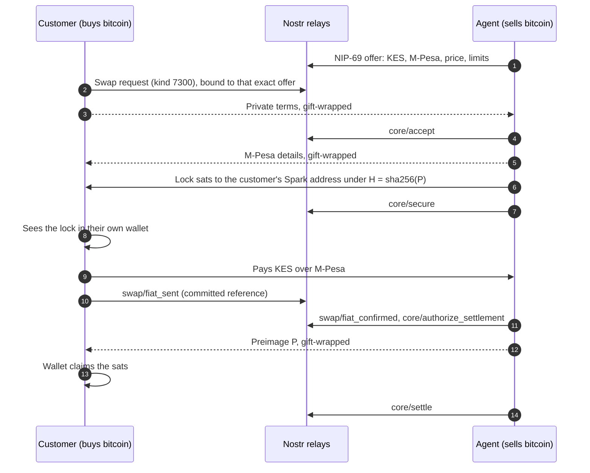

<p align="center">
  
</p>

<p align="center">
  <a href="https://github.com/pontmore/protocol"></a>
  
  
  
  <a href="LICENSE"></a>
</p>

# Pontspark

**A bitcoin wallet you hold yourself, with a built-in way to swap bitcoin for M-Pesa, mobile money, bank transfers or cash with real people near you.**

Pontspark is a mobile client for the [Pontmore protocol](https://github.com/pontmore/protocol). Every swap is coordinated in public, signed Nostr events, and the bitcoin is locked in a Spark HTLC between the two people trading. Nobody else ever holds it. There is no Pontspark server, no account and no sign-up: the app talks to Nostr relays and to your own [Breez](https://breez.technology) Spark wallet, and nothing else.

> [!WARNING]
> Pontspark is experimental software that moves real bitcoin on mainnet. The protocol profile it implements is itself experimental. Use small amounts, back up your recovery phrase, and expect breaking changes.

## Why Pontspark

- **Your keys, your phone.** One 12-word phrase backs your wallet, your Nostr identity and, if you run a desk, your agent keys. Keys never leave the device.
- **Bitcoin is locked before anyone sends money.** The seller locks sats to the buyer under a hash, the buyer checks the lock in their own wallet, and only then pays. The sats release when the payment arrives, or return to the seller when the lock expires.
- **Anyone can be an agent.** Flip to agent mode, choose your currencies, payment channels and margin, and go online. Requests that fit your offer are accepted automatically.
- **Open by default.** Offers are [NIP-69](https://github.com/nostr-protocol/nips/blob/master/69.md) orders, so peer-to-peer aggregators can list Pontspark agents next to Mostro, RoboSats and Peach. Swap state is PIP-02 event chains that any Pontmore client can verify.
- **Payment channels from a shared registry.** Fields, validation and masking for M-Pesa, Airtel Money, PesaLink, PayShap, cash and more come from [`@minmoto/payment-channels`](https://github.com/minmoto/payment-channels), not from a list baked into the app.

## Screens

### Personal mode: hold, send, receive and swap

<p align="center"></p>

### Agent mode: run a swap desk from your phone

<p align="center"></p>

<details>
<summary>All screenshots</summary>

| | | | | |
| --- | --- | --- | --- | --- |
|  |  |  |  |  |
| Wallet | Receive | Swap | Currencies | Agents |
|  |  |  |  |  |
| Me | Agent desk | Agent setup | Markets | Channels |

</details>

## What you can do

**Personal mode**

- Hold bitcoin in a self-custodial Breez Spark wallet: Lightning, Spark and on-chain, with a Lightning address.
- Send and receive by paste, QR scan or Lightning address, with amounts shown in your local currency.
- Find agents for your currency and payment channel, compare live prices, and buy or sell in a few taps.
- Follow each swap step by step, chat with the agent inside the swap, and report a problem if something goes wrong.

**Agent mode**

- Publish a desk: display name, markets, payment channels and margins for buying and selling.
- Go online to publish signed, expiring offers. Go offline to withdraw them.
- Auto-accept requests that fit your offer, limits and liquidity, or review them by hand.
- Lock, confirm and release from one screen. Payment details are sent privately, only to a customer whose swap you accepted.

## How a swap works



Every swap is a `pontmore/swap@1` coordination on PIP-02 event chains. Public events carry only the facts needed to check the chain. Payment details, Spark addresses, references and HTLC preimages move inside NIP-59 gift wraps.

The escrow is a [Spark HTLC](https://sdk-doc-spark.breez.technology/guide/htlcs.html): sats locked to the recipient under a payment hash, claimable only with the preimage before expiry, and returned to the sender automatically after it.

| Step | Buying bitcoin (`fiat_to_btc`) | Selling bitcoin (`btc_to_fiat`) |
| --- | --- | --- |
| Request | Customer signs the root (`7300`) with exact terms, commits to the agent's offer (`quote`) and its private terms. Gift-wraps them to the agent. | Same; private terms carry where to pay the customer. |
| Accept | Agent checks the request against its own offer, current price, liquidity and descriptor, then signs `core/accept` and sends its payment details. | Agent accepts and sends its Spark address. |
| Lock | Agent locks the sats to the customer's Spark address under `H = sha256(P)`. Its escrow key signs `core/secure`. | Customer locks the sats to the agent under their own `H`. Agent verifies the lock in its wallet, then its escrow key signs `core/secure`. |
| Fiat | Customer sees the lock **in their own wallet**, pays, and signs `swap/fiat_sent` with a committed reference. | Agent pays and signs `swap/fiat_sent`. |
| Release | Agent confirms (`swap/fiat_confirmed`, `core/authorize_settlement`) and sends `P` privately. Customer's wallet claims. | Customer confirms and sends `P`. Agent claims. |
| Settle | Agent's escrow key signs `core/settle`. | Same. |
| No payment | After `fiat_pay_by` the bitcoin provider signs `core/authorize_refund`. The lock returns on expiry and the escrow key signs `core/refund`. | Same, with the customer as provider. |

The party that provides bitcoin is the party that receives fiat, in both directions, so release always sits with whoever must confirm the money arrived. That matches how P2P desks work: the seller releases. The trade-off is that a dishonest seller can withhold release. The fiat sender then loses the fiat while the seller only gets their own bitcoin back at expiry. Disputes (`core/open_dispute`) freeze the chain publicly. The agent's resolver key can resume, authorize settlement or refund, or cancel. A resolution never moves funds.

Preimages are derived (`HMAC(identity key, root id)`) and HTLC sends use a derived idempotency key, so a crash or reinstall never double-locks and can always release.

## Currencies and payment channels

Currencies and channels come from the open [`@minmoto/payment-channels`](https://github.com/minmoto/payment-channels) registry. Pontspark allows mobile money, bank and cash channels; card channels are excluded because card payments can be charged back after the bitcoin is released.

| Currency | Channels today |
| --- | --- |
| 🇰🇪 KES | M-Pesa phone, till, paybill and Pochi la Biashara, PesaLink, Airtel Money, cash |
| 🇲🇼 MWK | Airtel Money, Airtel Money till, TNM Mpamba, TNM Mpamba merchant, cash |
| 🇿🇦 ZAR | PayShap ShapID, PayShap bank account, cash |
| 25 more | Cash, from Algeria to Zambia |

Adding a channel to the registry makes it available here on the next package bump. Channel ids go on the wire as `<id>@<schema version>`, for example `mpesa_phone_ke_kes@2`. Details are validated and normalized by the registry schema and only ever travel inside gift wraps.

## Protocol mapping

| Behaviour | Source |
| --- | --- |
| Agent definition `30360`, `t` capability tags, escrow `a` tag | PIP-00 |
| Escrow descriptor `30361`, expiry, `pontmore-network:` tags, exact-revision binding | PIP-01 |
| Roots `7300`, actions `7301`, `root`/`prev` linkage, fork freeze, kernel invariants | PIP-02 v2 |
| Roles, terms, deadlines, authorization table, dispute classes, `quote` and `private_terms` commitments | `pontmore/swap@1` |
| Offers as NIP-69 orders (`38383`, `y=pontmore`), one per currency and direction, with exact `price`, `channels`, escrow and resolver tags; agents honour a quote only within 1% of their current price and publish a coarse liquidity cap | `pontmore/swap@1` Offers (draft, [pontmore/protocol#25](https://github.com/pontmore/protocol/issues/25)) |
| `spark_htlc` escrow type; descriptor publisher is the bound `core/escrow` | Implementation assumption |
| Private payloads as gift-wrapped rumor kind `7310`; chat as NIP-17 kind `14` with an `e` tag to the root | Implementation assumption |
| Agent resolver is a derived key of the agent (`core/resolver`) | Implementation assumption |
| `payment_channel` ids, fields and validation from the payment-channels registry | Implementation assumption |

`src/protocol/swap.ts` replays a root and any unordered set of actions into state, and the engine refuses to publish an action its own reducer would reject. It is an independent TypeScript implementation of the profile; the Rust reference implementation lives in [pontmore/pontmore](https://github.com/pontmore/pontmore). Shared conformance vectors are tracked in [pontmore/protocol#26](https://github.com/pontmore/protocol/issues/26).

## Keys and backup

One 12-word phrase, generated on the device and stored in the keychain, backs everything:

- Breez Spark wallet seed
- NIP-06 account 0: public identity (profile, agent definition, swap participant, chat)
- NIP-06 account 1: agent escrow key (descriptor, `core/secure|settle|refund`)
- NIP-06 account 2: agent resolver key

Restoring the phrase restores funds, identity and agent authority. The app asks for a backup before the first buy and nudges before any receive. Passkeys and encrypted cloud backup are not in this version.

The swap cache uses authenticated NIP-44 encryption with a separate random key held in SecureStore under the device-only accessibility policy. Existing plaintext caches are encrypted before hydration. A missing key or an invalid ciphertext blocks cache loading; the recovery phrase does not restore this device-local cache key. Released provider preimages and claimed recipient preimages are omitted from subsequent cache snapshots. Existing backups made before this change may still contain plaintext.

Payment hashes and wallet payment IDs are reserved for one coordination in the local cache, including completed swaps. The engine waits for hydration and a durable binding before securing a received lock or marking fiat as paid. These reservations coordinate one app installation; they do not synchronize independent devices running the same wallet.

## Build it

You need Node.js 20+, the Android SDK (or Xcode for iOS) and a [Breez API key](https://breez.technology/request-api-key/).

```bash
cp .env.example .env            # set EXPO_PUBLIC_BREEZ_API_KEY
npm install
npx expo run:android            # or: npx expo run:ios
```

The Breez SDK is a native module, so Expo Go won't work. Use a development build (`expo run:*` or EAS). Without a Breez API key the app still runs, discovers agents and signs Nostr events, but the wallet shows as offline. Set `EXPO_PUBLIC_BREEZ_NETWORK=regtest` to try it without real funds.

Checks:

```bash
npm run typecheck
npm test                         # protocol reducer, offers, channels, keys, gift wraps, money
npx tsx scripts/relay-smoke.ts   # a full swap chain over live relays (test currency XTS, regtest)
```

## Code map

```text
src/protocol/   pure Pontmore logic: kinds, templates, NIP-69 offers, payloads, swap@1 reducer (+ tests)
src/lib/        keys (NIP-06, HTLC secrets, commitments), money, channels registry adapter, links, swap copy
src/services/   wallet (Breez), nostr pool, discovery, swap engine, agent publishing loop
src/store/      zustand stores: session, wallet, swaps cache, agent config, discovery
src/screens/    onboarding, backup, wallet, send/receive/scan, swap flow, chat, agents, agent desk, settings
src/ui/         theme, components, schema-driven payment channel fields
```

## Known limits

- **Agents must keep the app open while online.** Without a server there are no push notifications. Offers expire on their own after 30 minutes, so a closed app drops out of discovery.
- **Both sides of a swap use Spark wallets**, which the app provides. Other Pontmore clients need the same `spark_htlc` escrow assumption to trade with Pontspark.
- **Disputes rely on the agent's resolver.** There is no neutral arbitrator.
- **Reputation is a raw count** of `core/settle` events signed by the agent's escrow key.
- **Regulation is your responsibility.** Running a swap desk may need a licence where you operate (for example under Kenya's VASP Act).

## Related

- [pontmore/protocol](https://github.com/pontmore/protocol): PIP-00, PIP-01, PIP-02 and the `pontmore/swap@1` profile
- [pontmore/pontmore](https://github.com/pontmore/pontmore): Rust reference implementation and `pontmored` operator daemon
- [minmoto/payment-channels](https://github.com/minmoto/payment-channels): open registry of fiat payment channel schemas
- [Breez SDK (Spark)](https://sdk-doc-spark.breez.technology/): the wallet underneath

## License

[MIT](LICENSE)
